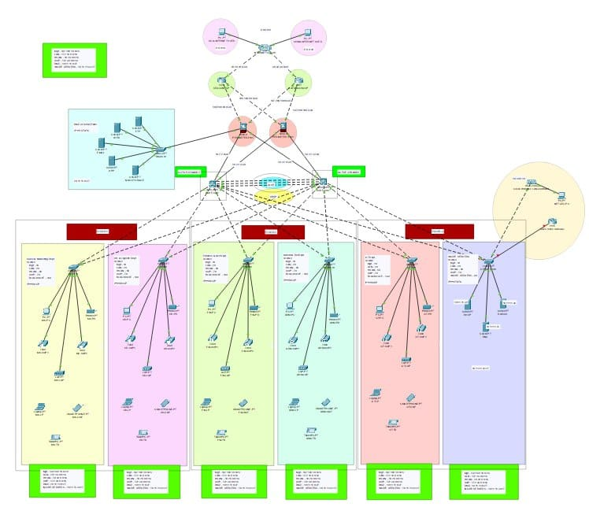
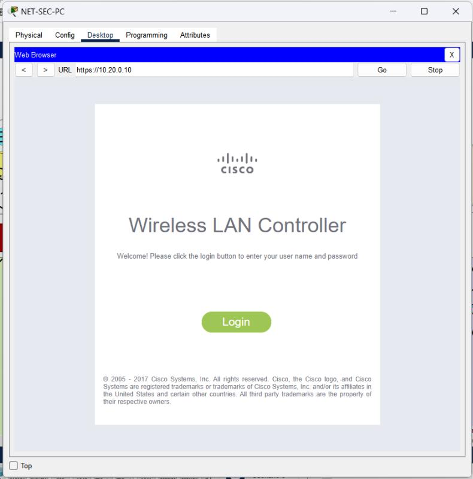
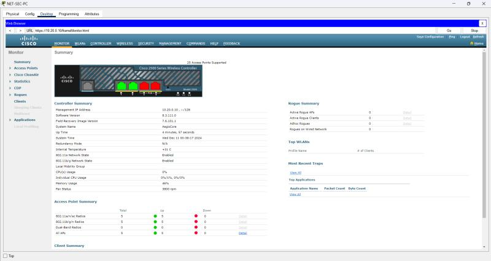
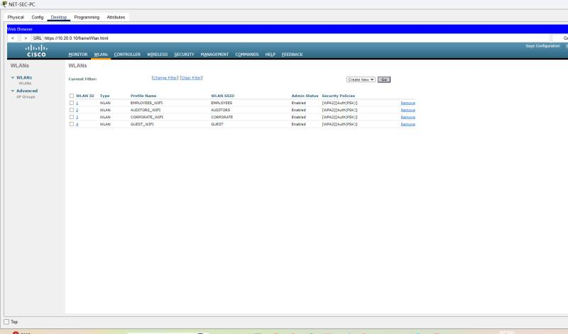
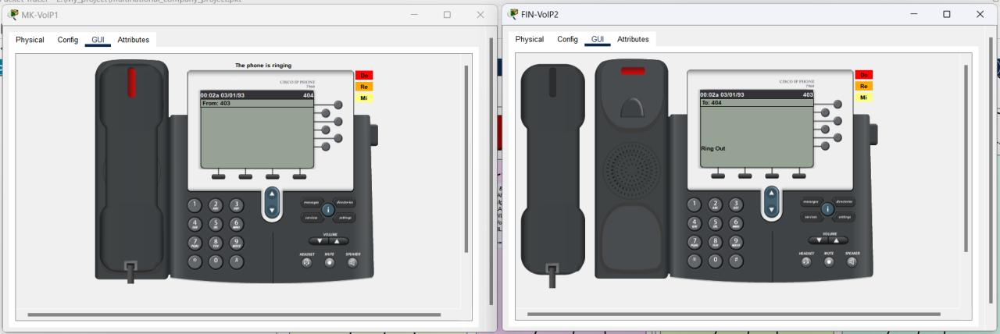
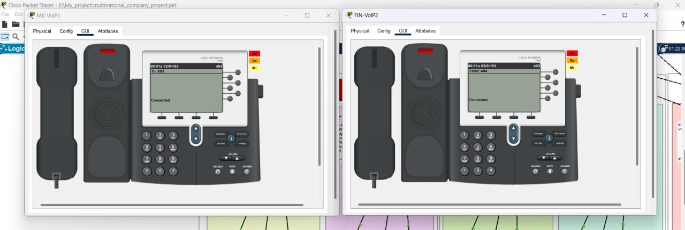

<div align="center">

# 🌐 Secure Multinational Company Management System

*A comprehensive enterprise network infrastructure designed for a secure, scalable, and globally connected multinational corporation.*


</div>

---

## 📋 Table of Contents

- [Project Overview](#-project-overview)
- [Network Architecture](#-network-architecture)
- [Branch Structure](#-branch-structure)
- [VLAN Segmentation](#-vlan-segmentation)
- [Wireless Network (WLAN)](#-wireless-network-wlan)
- [VoIP Telephony](#-voip-telephony)
- [Centralized Server Farm](#-centralized-server-farm)
- [Network Security](#-network-security)
- [Technologies Used](#-technologies-used)
- [Key Highlights](#-key-highlights)

---

## 🔍 Project Overview

This project designs and simulates a **fully functional, secure enterprise network** for a multinational company using **Cisco Packet Tracer**. The infrastructure spans **3 major branches**, each containing multiple departments, all interconnected through a hierarchical core with redundant WAN links and centralized services.

> The system ensures seamless global communication, robust network segmentation, centralized wireless management, inter-branch VoIP, and enterprise-grade security across all sites.

---

## 🏗️ Network Architecture

The design follows the **Cisco 3-Tier Hierarchical Model**:

```
                    ┌─────────────────────────────┐
                    │      🌍  ISP / Internet       │
                    │    (Dual ISP – Redundancy)    │
                    └──────────┬──────────┬─────────┘
                               │          │
                    ┌──────────▼──────────▼─────────┐
                    │        CORE LAYER              │
                    │   Core Router 1 + Core Router 2│
                    │      (Redundant WAN Links)     │
                    └──────────┬──────────┬─────────┘
                               │          │
                    ┌──────────▼──────────▼─────────┐
                    │     DISTRIBUTION LAYER         │
                    │  Multilayer Switches (x2)      │
                    │  NET-SEC-PCs │ Server Farm      │
                    └────┬─────────┼──────────┬──────┘
                         │         │          │
               ┌─────────▼┐  ┌─────▼────┐  ┌─▼────────┐
               │ Branch 1  │  │ Branch 2  │  │ Branch 3  │
               │(Depts A-C)│  │(Depts D-F)│  │(Depts G-I)│
               └──────────┘  └──────────┘  └──────────┘
```

| Layer | Devices | Role |
|-------|---------|------|
| **Core** | 2× Core Routers | WAN routing, ISP redundancy, inter-branch traffic |
| **Distribution** | 2× Multilayer Switches | VLAN routing, policy enforcement, uplink aggregation |
| **Access** | Per-branch switches | End-device connectivity, VLAN tagging |

<div align="center">

### 🗺️ Full Network Topology



*Complete network topology — 3 branches, dual core routers, distribution switches, centralized server farm, and WLAN zone*

</div>

---

## 🏢 Branch Structure

The network consists of **3 branches**, each representing a regional office of the multinational company. Every branch is internally segmented into multiple **departments**, each mapped to its own VLAN.

```
📦 Branch 1                 📦 Branch 2                 📦 Branch 3
├── 🟡 Department A         ├── 🟡 Department D         ├── 🟡 Department G
├── 🟣 Department B         ├── 🟣 Department E         ├── 🟣 Department H
└── 🔵 Department C         └── 🔵 Department F         └── 🔵 Department I
     ↳ PCs, Laptops              ↳ PCs, Laptops              ↳ PCs, Laptops
     ↳ VoIP Phones               ↳ VoIP Phones               ↳ VoIP Phones
     ↳ Wireless APs              ↳ Wireless APs              ↳ Wireless APs
```

Each branch connects back to the **Distribution Layer** via dedicated uplinks, with inter-branch communication routed through the **Core Layer**.

---

## 🔀 VLAN Segmentation

VLANs are used to **logically isolate departments**, preventing unauthorized cross-department traffic and improving overall network performance and security.

| VLAN | Department | Color Code | Purpose |
|------|------------|------------|---------|
| VLAN 10 | Employees | 🟡 Yellow | General staff workstations & laptops |
| VLAN 20 | Management | 🔵 Blue | Administrative systems |
| VLAN 30 | Finance | 🟣 Purple | Sensitive financial data systems |
| VLAN 40 | Auditors | 🟠 Orange | Audit & compliance terminals |
| VLAN 50 | Marketing | 🟢 Green | Marketing & media workstations |
| VLAN 99 | Native/Mgmt | ⚫ Black | Switch management, trunking |

> Inter-VLAN routing is handled at the **Distribution Layer** via Layer 3 Multilayer Switches, ensuring controlled and policy-based communication between departments.

---

## 📡 Wireless Network (WLAN)

Wireless connectivity is managed centrally using a **Cisco 2500 Series Wireless LAN Controller (WLC)**.

### 🎛️ WLC Details

| Parameter | Value |
|-----------|-------|
| **Management IP** | `10.20.0.10` |
| **System Name** | MegaCore |
| **Software Version** | 8.5.110.0 |
| **Access Interface** | `https://10.20.0.10` (HTTPS) |
| **Total Access Points** | 5 APs (All UP ✅) |
| **802.11a/n/ac Radios** | 5 UP / 0 DOWN |
| **802.11b/g/n Radios** | 5 UP / 0 DOWN |
| **Memory Usage** | 44% |

<div align="center">

<table>
<tr>
<td align="center"></td>
<td align="center"></td>
</tr>
<tr>
<td align="center"><em>🔐 HTTPS Login — <code>https://10.20.0.10</code></em></td>
<td align="center"><em>📊 WLC Summary Dashboard — 5 APs Active</em></td>
</tr>
</table>

</div>

### 📶 Configured WLANs

| WLAN ID | Profile Name | SSID | Security Policy | Status |
|---------|-------------|------|-----------------|--------|
| 1 | EMPLOYEES_WIFI | `EMPLOYEES` | WPA2 / Auth(PSK) | ✅ Enabled |
| 2 | AUDITORS_WIFI | `AUDITORS` | WPA2 / Auth(PSK) | ✅ Enabled |
| 3 | CORPORATE_WIFI | `CORPORATE` | WPA2 / Auth(PSK) | ✅ Enabled |
| 4 | GUEST_WIFI | `GUEST` | WPA2 / Auth(PSK) | ✅ Enabled |

<div align="center">



*WLC WLANs page — all 4 SSIDs configured and enabled with WPA2/PSK security policies*

</div>

> All SSIDs use **WPA2 with Pre-Shared Key (PSK)** authentication, ensuring encrypted wireless communication across all user categories including guests.

---

## 📞 VoIP Telephony

The network supports **full inter-branch VoIP calling** using Cisco IP Phones, allowing employees across different departments and branches to communicate seamlessly.

### ✅ Verified Call Test

```
  📞 MK-VoIP1 (Marketing)              📞 FIN-VoIP2 (Finance)
  ┌─────────────────────┐              ┌─────────────────────┐
  │  Extension : 401    │   ────────►  │  Extension : 402    │
  │  Status: RINGING    │              │  Status: RING OUT   │
  └─────────────────────┘              └─────────────────────┘
               ↓  Call Established                ↓
  ┌─────────────────────┐              ┌─────────────────────┐
  │  Status: CONNECTED  │   ◄────────► │  Status: CONNECTED  │
  └─────────────────────┘              └─────────────────────┘
```

<div align="center">

<table>
<tr>
<td align="center"></td>
<td align="center"></td>
</tr>
<tr>
<td align="center"><em>📞 MK-VoIP1 calling FIN-VoIP2 — Ringing</em></td>
<td align="center"><em>✅ Call Established — Both Phones Connected</em></td>
</tr>
</table>

</div>

| Feature | Detail |
|---------|--------|
| **Protocol** | VoIP (SIP/SCCP via Cisco CME) |
| **Devices** | Cisco 7900 Series IP Phones |
| **Scope** | Inter-branch (Marketing ↔ Finance confirmed) |
| **Call Test** | ✅ Successful end-to-end call |

---

## 🖥️ Centralized Server Farm

A dedicated **Server Farm** is housed at the distribution layer, providing centralized services to all branches across the network.

```
        ┌─────────────────────────────────────────┐
        │          🖥️  Multinational Server Farm   │
        ├─────────────────────────────────────────┤
        │  🌐  Web Server       │  DNS resolution  │
        │  📧  Email Server     │  Corp messaging  │
        │  📁  File Server      │  Data storage    │
        │  🔧  DHCP Server      │  IP management   │
        │  🔍  DNS Server       │  Name resolution │
        └─────────────────────────────────────────┘
```

| Service | Role |
|---------|------|
| **DHCP** | Automatic IP address assignment to all branch hosts |
| **DNS** | Internal name resolution across the enterprise |
| **Web Server** | Internal company web portal |
| **Email Server** | Corporate communication |
| **File Server** | Centralized file sharing and storage |

---

## 🔒 Network Security

Security is enforced at multiple layers throughout the network.

### 🛡️ Security Measures Implemented

```
🌐 Internet
    │
    ▼
🔒 Dual ISP Routers  ←── WAN-level redundancy & edge filtering
    │
    ▼
🔒 Core Routers      ←── Routing policies, ACLs
    │
    ▼
🔒 Multilayer Switches ←── VLAN isolation, inter-VLAN ACLs
    │
    ▼
🔒 NET-SEC-PCs       ←── Network security monitoring stations
    │
    ▼
📡 WLC (10.20.0.10)  ←── HTTPS management, WPA2 on all SSIDs
```

| Security Layer | Mechanism |
|----------------|-----------|
| **VLAN Isolation** | Departments segmented — no unauthorized cross-traffic |
| **WPA2-PSK** | All 4 WLANs use WPA2 encryption |
| **HTTPS on WLC** | Encrypted web management (`https://10.20.0.10`) |
| **NET-SEC-PCs** | Dedicated security monitoring nodes at distribution |
| **Dual ISP** | WAN redundancy prevents single point of failure |
| **Centralized AAA** | Centralized authentication via server farm |

---

## 🛠️ Technologies Used

<div align="center">

| Technology | Tool / Protocol | Purpose |
|------------|----------------|---------|
|  | Cisco Packet Tracer | Network simulation |
| 🔀 **VLANs** | IEEE 802.1Q | Network segmentation |
| 📡 **WLAN** | IEEE 802.11a/b/g/n/ac | Wireless connectivity |
| 🎛️ **WLC** | Cisco 2500 Series | Centralized AP management |
| 🔒 **WPA2** | PSK Authentication | Wireless security |
| 📞 **VoIP** | Cisco IP Phone 7900 | Enterprise telephony |
| 🌐 **DHCP** | Dynamic Host Config | Automatic IP assignment |
| 🔍 **DNS** | Domain Name System | Name resolution |
| 🔁 **Routing** | Static / Dynamic (OSPF/EIGRP) | Inter-branch routing |
| 🖥️ **Servers** | Web, Email, File, DHCP, DNS | Centralized services |

</div>

---

## ✨ Key Highlights

<div align="center">

| 🏆 Achievement | Details |
|----------------|---------|
| 🌍 **Multinational Scale** | 3 branches, multiple departments each |
| 🔀 **Full VLAN Segmentation** | Each department isolated in its own VLAN |
| 📡 **Centralized WLAN** | 1 WLC managing 5 APs across 4 SSIDs |
| 📞 **Working VoIP** | Inter-branch calls verified (MK ↔ FIN) |
| 🔒 **Multi-Layer Security** | VLANs + WPA2 + NET-SEC-PCs + HTTPS |
| ♻️ **Redundancy** | Dual ISP + dual core routers |
| 🖥️ **Centralized Services** | Single server farm serving all branches |
| 🛡️ **WPA2 on All WLANs** | All 4 SSIDs secured with WPA2/PSK |

</div>

---

<div align="center">

*Built with ❤️ using Cisco Packet Tracer*


</div>
